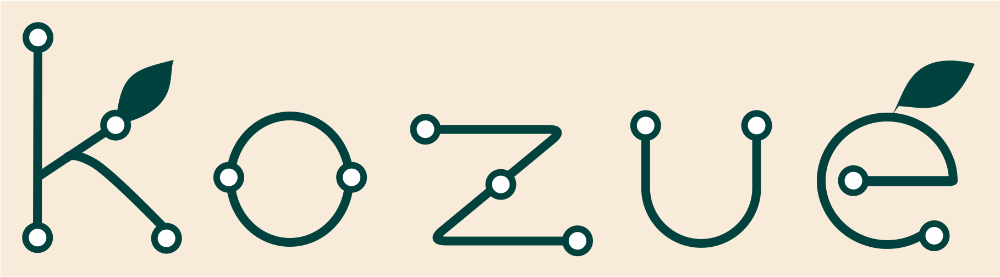

<p align="center">
  
</p>

[](https://github.com/naoak/kozue/actions/workflows/ci.yml)
[](#license)
[](https://naoak.github.io/kozue/)

kozue is a diagram compiler that takes a custom DSL (`.kzd`) as input and produces deterministic SVG output. It parses the DSL into a semantic IR, lays out the diagram with a naive layered algorithm, and renders it to SVG. The same input always produces byte-identical output.

**[Try it in your browser →](https://naoak.github.io/kozue/)** — a WASM-powered playground that compiles kozue, Mermaid, and PlantUML to SVG, PNG, terminal text, DOT, draw.io, and Excalidraw.

> **kozue** (梢, _kozue_) is Japanese for "treetop" — the slender tip of a branch.
> The name nods to the branching, tree-like structure of the diagrams it compiles.

> **Note:** This project is in an early stage of active development. Expect frequent breaking changes.

## Usage

```sh
kozue render examples/hello.kzd -o hello.svg
kozue check examples/hello.kzd
kozue fmt examples/hello.kzd
kozue compat mermaid
```

| Command | Purpose |
| --- | --- |
| `render` | Compiles a diagram to SVG (defaults to `<input>.svg` if `-o` is omitted) or another `--format`. |
| `check` | Parses and semantically validates the input, printing `OK` on success. |
| `fmt` | Rewrites a kozue DSL (`.kzd`) file into canonical normal form in place. `--check` exits non-zero if the file would change (for CI); `--stdout` writes the result to stdout instead of rewriting the file. |
| `compat` | Prints a feature-compatibility table for a frontend language (`mermaid` or `plantuml`). |

Parse and semantic errors are printed to stderr with a non-zero exit code.

### Input languages

The frontend is auto-detected from the input file extension: kozue DSL (`.kzd`), Mermaid (`.mmd`/`.mermaid`), and PlantUML (`.puml`/`.plantuml`/`.pu`/`.iuml`) all parse into the same semantic IR. Pass `--lang <kozue|mermaid|plantuml>` to `render` or `check` to override auto-detection. Run `kozue compat <language>` to see which features of a given frontend are supported.

### Output formats

`render --format <fmt>` selects the backend:

| Format | Output |
| --- | --- |
| `svg` (default) | Laid-out SVG |
| `term` | Plain-text terminal rendering |
| `png` | Deterministic raster PNG |
| `drawio` | Editable draw.io / mxGraph XML |
| `dot` | Graphviz DOT — for `graph` and `state` diagrams; Graphviz does its own layout |
| `excalidraw` | Editable Excalidraw (`.excalidraw`) JSON scene |

```sh
kozue render examples/hello.kzd --format dot -o hello.dot
dot -Tsvg hello.dot -o hello.svg   # then lay it out with Graphviz
```

DOT export reads the semantic diagram directly, so it does not use kozue's layout engine. Sequence diagrams have no faithful DOT representation and produce an error.

## Note on Japanese glyphs

Text width is measured with the embedded **DejaVu Sans** font. DejaVu Sans does not contain Japanese glyphs, so for any character missing from the font (such as kanji, hiragana, and katakana) a fallback advance width of `font_size` (1 em per character) is used. Labels still render as text in the SVG with `font-family="DejaVu Sans"`; the actual glyph shown depends on the viewer's font fallback, but layout box sizes remain deterministic.

## Editor support (LSP)

kozue ships a Language Server Protocol implementation (`kozue-lsp`) that provides real-time parse diagnostics (error squiggles) for `.kozue`/`.kzd`, `.mmd`/`.mermaid`, and `.puml`/`.plantuml`/`.pu`/`.iuml` files.

### Build the language server

```sh
cargo build -p kozue-lsp
# Binary: target/debug/kozue-lsp  (or target/release/kozue-lsp with --release)
```

### VSCode extension

A ready-made VSCode extension lives in [`editors/vscode/`](editors/vscode/). It launches `kozue-lsp` over stdio and forwards diagnostics to the Problems panel.

```sh
cd editors/vscode
npm install
npm run compile
# Then open editors/vscode/ in VSCode and press F5 to launch the Extension Development Host.
```

To use a custom binary path, set `"kozue.serverPath"` in your VSCode `settings.json`.

### Scope

The LSP server currently provides:

- **Diagnostics** — parse errors appear as squiggles in real time.
- **Hover** — hovering over a node or participant id shows its label as Markdown. Works for all supported languages (kozue, Mermaid, PlantUML), since they share one IR.
- **Formatting** — running "Format Document" on a `.kozue`/`.kzd` file reformats it with `kozue fmt`. Mermaid and PlantUML files are left untouched (no formatter exists for them yet).

Go-to-definition and other features are planned for future milestones.

## WebAssembly

The [`kozue-wasm`](crates/kozue-wasm/) crate exposes the compiler to JavaScript via `wasm-bindgen`, with three functions: `render_svg` (parse → layout → SVG string), `render_png` (parse → layout → PNG bytes), and `check` (parse-only validation). Determinism carries over: the same input always produces identical output in the browser.

The generated `pkg/` directory is **not** checked into the repository (it is git-ignored), so `demo.html` will not work on a fresh clone until you build the bindings yourself. If the buttons and the language selector appear dead, it usually means `pkg/` is missing: the ES-module import fails and none of the page's event handlers get registered (check the browser console for a module-load error).

Prerequisites — the `wasm32-unknown-unknown` target and the `wasm-bindgen` CLI, whose version **must match** the `wasm-bindgen` dependency pinned in `Cargo.toml` exactly (a mismatch produces broken bindings):

```sh
rustup target add wasm32-unknown-unknown
cargo install wasm-bindgen-cli --version 0.2.92   # match Cargo.toml
```

Build the bindings from the workspace root:

```sh
cargo build -p kozue-wasm --target wasm32-unknown-unknown --release
wasm-bindgen target/wasm32-unknown-unknown/release/kozue_wasm.wasm \
  --out-dir crates/kozue-wasm/pkg --target web
```

Then serve the crate directory over HTTP (ES modules and WASM require HTTP, not `file://`) and open the demo:

```sh
python3 -m http.server 8080 --directory crates/kozue-wasm/
# open http://localhost:8080/demo.html
```

## License

Licensed under either of

- Apache License, Version 2.0 ([LICENSE-APACHE](LICENSE-APACHE))
- MIT License ([LICENSE-MIT](LICENSE-MIT))

at your option.

Unless you explicitly state otherwise, any contribution intentionally submitted
for inclusion in the work by you, as defined in the Apache-2.0 license, shall be
dual licensed as above, without any additional terms or conditions.
